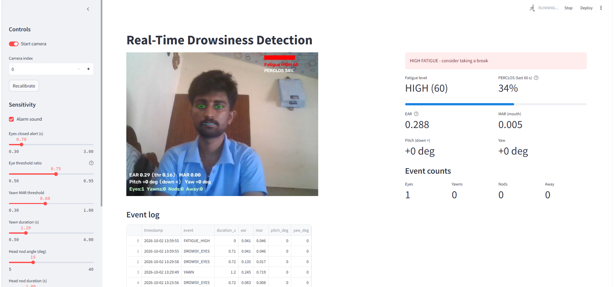
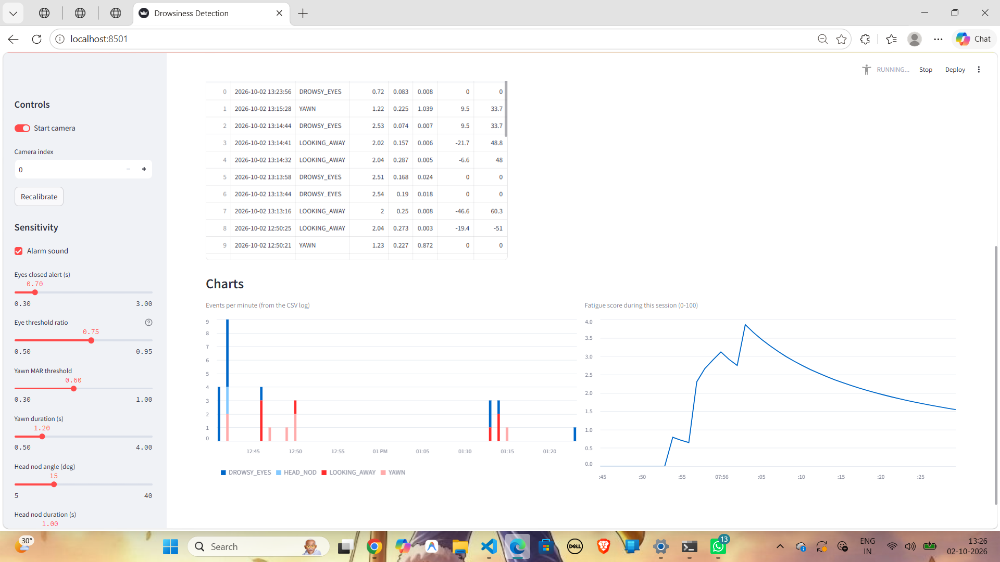

# Real-Time Drowsiness Detection

A webcam-based fatigue monitor built with **OpenCV**, **MediaPipe Face Mesh**, and **Streamlit**. It watches your eyes, mouth, and head pose in real time, raises an alarm when you look drowsy, and logs every event to a CSV file.

No model training is needed. Everything is computed from facial landmarks, so it runs smoothly on an ordinary laptop.

<!-- Add your screenshots here, e.g.


-->

## Features

| Feature | How it works |
| --- | --- |
| **Eye-closure detection** | Eye Aspect Ratio (EAR). An alert fires when your eyes stay closed for 0.7 s. |
| **Yawn detection** | Mouth Aspect Ratio (MAR). An alert fires when your mouth stays wide open for 1.2 s. |
| **Head-nod detection** | Head pitch from `solvePnP`. An alert fires when your head drops more than 15° for 1 s. |
| **Looking-away detection** | Head yaw from `solvePnP`. An alert fires when your head is turned more than 35° for 2 s. |
| **Fatigue score** | A 0 to 100 score combining PERCLOS with recent eye alerts, yawns, and nods. Levels: LOW, MEDIUM, HIGH. |
| **Auto-calibration** | The first 3 seconds measure your normal EAR and head position, so thresholds adapt to your face, glasses, and camera angle. |
| **CSV event log** | Every alert is saved with a timestamp, duration, and EAR/MAR/pitch/yaw values. |
| **Streamlit dashboard** | Live video, metrics, event counters, an event log table, charts, and sensitivity sliders. |
| **Sound alarm** | A beep for eye closure, head nodding, and when the fatigue level first reaches HIGH. |

## Project structure

```
drowsiness_core.py   Detection engine (eyes, yawn, head pose, fatigue score, logging, alarm)
run_desktop.py       Runs the detector in an OpenCV window
app.py               Streamlit dashboard
requirements.txt     Package versions known to work together
drowsiness_log.csv   Created automatically when the first event is logged
```

`drowsiness_detector.py` (if present) is the original single-file version with eye detection only.

## Installation

Requires **Python 3.9 to 3.12** (MediaPipe does not install on newer versions) and a webcam.

```bash
# 1. Create and activate a virtual environment
python -m venv venv
venv\Scripts\activate            # Windows
source venv/bin/activate         # macOS / Linux

# 2. Install the packages
pip install -r requirements.txt
```

The versions in `requirements.txt` matter. MediaPipe 0.10.14 needs `protobuf` below version 5, and newer Streamlit releases need protobuf 5 or higher, so Streamlit is pinned to 1.40.1.

## Usage

**Desktop window**

```bash
python run_desktop.py
```

Keys: `q` or `Esc` to quit, `r` to recalibrate.

**Browser dashboard**

```bash
streamlit run app.py
```

Switch on **Start camera** in the sidebar. For the first 3 seconds, keep your eyes open and look at the camera while it calibrates. Use **Recalibrate** if you change position or lighting.

Streamlit runs locally: the webcam and alarm sound are on the computer where you start it.

## How it works

1. **Capture and landmarks.** OpenCV reads each frame, and MediaPipe Face Mesh returns 468 facial landmarks.
2. **EAR (eyes).** `EAR = (|p2-p6| + |p3-p5|) / (2 * |p1-p4|)` over six landmarks per eye. EAR drops toward zero when the eye closes.
3. **MAR (mouth).** The same idea with three vertical lip distances divided by mouth width. MAR rises sharply during a yawn.
4. **Head pose.** Six face points are matched to a generic 3D face model with `cv2.solvePnP`. Pitch (nodding) and yaw (turning) are measured relative to your calibrated neutral pose.
5. **Time-based filtering.** Each condition must last a minimum number of seconds, so normal blinks, talking, and brief glances do not trigger alerts. Using seconds instead of frame counts keeps behavior the same at any camera frame rate.
6. **PERCLOS.** The share of the last 60 seconds in which your eyes were closed. It catches slow, sleepy eye closing that never lasts long enough to trigger a single alert. Above roughly 15 to 20% is a common drowsiness sign.
7. **Fatigue score (0 to 100).**

   | Component | Max points |
   | --- | --- |
   | PERCLOS (full marks at 25%) | 50 |
   | Eye-closure alerts in the last 5 min (full at 2) | 20 |
   | Yawns in the last 5 min (full at 3) | 20 |
   | Head nods in the last 5 min (full at 2) | 10 |

   LOW is below 30, MEDIUM is 30 to 59, HIGH is 60 or more.

## Settings

All defaults are in the `Config` class in `drowsiness_core.py`, and most can be changed live with the dashboard sliders.

| Setting | Default | Meaning |
| --- | --- | --- |
| `eye_closed_seconds` | 0.7 | Eyes closed this long triggers an alert |
| `threshold_ratio` | 0.75 | Alarm EAR is your calibrated open-eye EAR times this |
| `mar_threshold` / `yawn_seconds` | 0.60 / 1.2 | Mouth openness and duration for a yawn |
| `nod_degrees` / `nod_seconds` | 15 / 1.0 | Head drop angle and duration |
| `away_degrees` / `away_seconds` | 35 / 2.0 | Head turn angle and duration |
| `fatigue_medium` / `fatigue_high` | 30 / 60 | Fatigue score limits |

## Event log format

`drowsiness_log.csv` is created next to the scripts.

```
timestamp,event,duration_s,ear,mar,pitch_deg,yaw_deg
```

Event types: `DROWSY_EYES`, `YAWN`, `HEAD_NOD`, `LOOKING_AWAY`, `FATIGUE_HIGH`.

If the file is open in Excel on Windows, writes fail with a warning in the terminal. Close the file and logging resumes.

## Troubleshooting

| Problem | Fix |
| --- | --- |
| `module 'mediapipe' has no attribute 'solutions'` | `pip install mediapipe==0.10.14` |
| `mediapipe requires protobuf<5` after installing Streamlit | `pip install "streamlit==1.40.1" "protobuf>=4.25.3,<5"` |
| MediaPipe will not install | Use Python 3.9 to 3.12 |
| `Could not open camera index 0` | Close apps that use the camera, or change the camera index |
| False eye alerts | Recalibrate in a relaxed pose, or lower the threshold ratio (e.g. 0.70) |
| Poor detection | Use good lighting that falls on your face, and avoid strong glare on glasses |

## Limitations

- Ordinary webcams struggle in low light. Real driver-monitoring systems use infrared cameras.
- Glasses, reflections, and extreme camera angles can reduce accuracy.
- Thresholds are personal, which is why calibration exists.
- This is a **demonstration project, not a certified safety system**. Do not rely on it while driving or operating machinery.

## Possible future work

- Save and restore slider settings between sessions
- Per-session reports and exportable charts
- Infrared camera support for night use
- Mobile or in-vehicle deployment